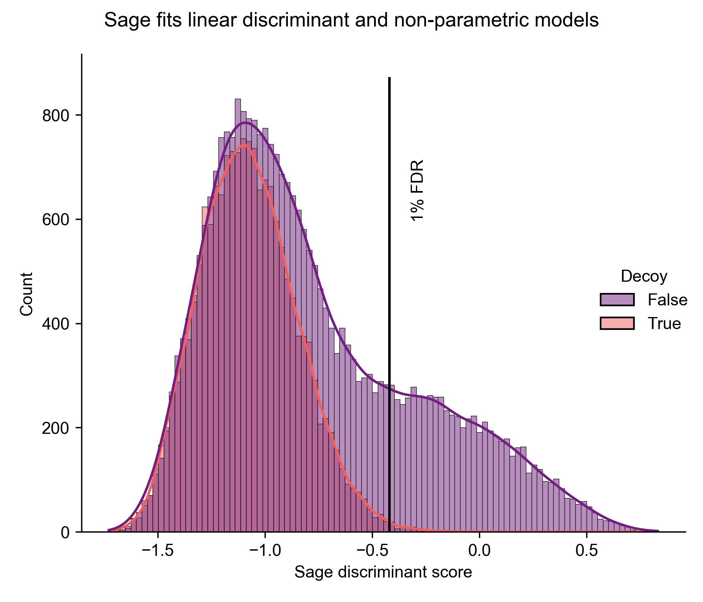

# Sage: proteomics searching so fast it seems like magic

[](https://github.com/lazear/sage/actions/workflows/rust.yml)

Sage is a proteomics search engine - a tool that transforms raw mass spectra from proteomics experiments into peptide identificatons via database searching & spectral matching. 
But, it's also more than just a search engine - Sage includes a variety of advanced features that make it a one-stop shop: retention time prediction, quantification (both isobaric & LFQ), peptide-spectrum match rescoring, and FDR control.

Sage was designed with cloud computing in mind - massively parallel processing and the ability to directly stream compressed mass spectrometry data to/from AWS S3 enables unprecedented search speeds with minimal cost. 
(Sage also runs just as well reading local files from your Mac/PC/Linux device)

Let's not forget to mention that it is incredibly fast, sensitive, 100% free, and open source!


Check out the [blog post introducing Sage](https://lazear.github.io/sage/) for more information and full benchmarks!
 
## Features

- Incredible performance out of the box
- Effortlessly cross-platform (Linux/MacOS/Windows), effortlessly parallel (uses all of your CPU cores)
- Fragment indexing strategy allows for blazing fast narrow and open searches (> 500 Da precursor tolerance)
- MS3-TMT quantification (R-squared of 0.999 with Proteome Discoverer)
- Capable of searching for chimeric/co-fragmenting spectra
- Retention time prediction models fit to each LC/MS run
- PSM rescoring using built-in linear discriminant analysis (LDA)
- PEP calculation using a non-parametric model (KDE)
- FDR calculation using target-decoy competition and picked-peptide & picked-protein approaches
- Percolator/Mokapot compatible output
- Configuration by JSON file
- Built-in support for reading gzipped-mzML files
- Support for reading/writing directly from AWS S3

### Experimental features

- Label-free quantification: consider all charge states & isotopologues *a la* FlashLFQ

### Assign multiple peptides to complex spectra


### Sage trains machine learning models for FDR refinement and posterior error probability calculation

- Boosts PSM identifications using prediction of retention times with a [linear regression](https://doi.org/10.1021/ac070262k) model fit to each LC/MS run
- Hand-rolled, 100% pure Rust implementations of Linear Discriminant Analysis and KDE-mixture models for refinement of false discovery rates
- Models demonstrate 1:1 results with scikit-learn, but have increased performance
- No need for a second post-search pipeline step



# Installation

Sage is distributed as source code, and as a standalone executable file.

## Compiling the development version

1. Install the [Rust programming language compiler](https://rustup.rs/)
2. Download Sage source code via git: `git clone https://github.com/lazear/sage.git` or by [zip file](https://github.com/lazear/sage/archive/refs/heads/master.zip)
3. Compile: `cargo build --release`
4. Run: `./target/release/sage config.json`

Once you have Rust installed, you can copy and paste the following lines into your terminal to complete the above instructions, and run Sage on the example mzML provided in the repository (a single scan from PXD016766)

```sh
git clone https://github.com/lazear/sage.git
cd sage
cargo run --release tests/config.json 
```

## Downloading the latest release

1. Visit the [Releases](https://github.com/lazear/sage/releases/latest) website.
2. Download the correct pre-compiled binary for your operating system.
3. Run: `local/location/of/the/executable/sage config.json`

# Interfacing with AWS S3

Sage is capable of natively reading & writing files to AWS S3:

- S3 paths should be specified as `s3://bucket/prefix/key.mzML.gz` or `s3://bucket/prefix` for output folder
- See [AWS docs](https://docs.aws.amazon.com/sdk-for-rust/latest/dg/credentials.html) for configuring your credentials
- Using S3 may incur data transfer charges as well as multi-part upload request charges.

# Usage 

```shell
$ sage --help
Usage: sage [OPTIONS] <parameters> [mzml_paths]...

🔮 Sage 🧙 - Proteomics searching so fast it feels like magic!

Arguments:
  <parameters>     The search parameters as a JSON file.
  [mzml_paths]...  mzML files to analyze. Overrides mzML files listed in the parameter file.

Options:
  -f, --fasta <fasta>
          The FASTA protein database. Overrides the FASTA file specified in the parameter file.
  -o, --output_directory <output_directory>
          Where the search and quant results will be written. Overrides the directory specified in the parameter file.
      --no-parallel
          Turn off parallel file searching. Useful for memory constrained systems or large sets of files.
  -h, --help
          Print help information
  -V, --version
          Print version information
```

Sage is called from the command line using and requires a path to a JSON-encoded parameter file as an argument (see below). 

Example usage: `sage config.json`

Some options in the parameters file can be over-written using the command line
interface. These are:

1. The paths to the raw mzML data
2. The path to the database (fasta file)
3. The output directory

For example: 

```
# Specify fasta and output dir:
sage -f proteins.fasta -o output_directory config.json

# Specify mzML files:
sage -f proteins.fasta config.json *.mzML

# Specify mzML file located in an S3 bucket
sage config.json s3://my-bucket/YYYY-MM-DD_expt_A_fraction_1.mzML.gz
```

Running Sage will produce several output files (located in either the current directory, or `output_directory` if that option is specified):
- Record of search parameters (`results.json`) will be created that details input/output paths and all search parameters used for the search
- MS2 search results will be stored as a tab-separated file (`results.sage.tsv`) file - this is a tab-separated file, which can be opened in Excel/Pandas/etc
- MS3 search results will be stored as a tab-separated file (`quant.tsv`) if `quant.tmt` option is used in the parameter file

## Configuration file schema

### Notes

- The majority of parameters are optional - only "database.fasta", "precursor_tol", and "fragment_tol" are required. Sage will try and use reasonable defaults for any parameters not supplied
- Tolerances are specified on the *experimental* m/z values. To perform a -100 to +500 Da open search (mass window applied to *precursor*), you would use `"da": [-500, 100]`

### Decoys

Using decoy sequences is critical to controlling the false discovery rate in proteomics experiments. Sage can use decoy sequences in the supplied FASTA file, or it can generate internal sequences. Sage reverses tryptic peptides (not proteins), so that the [picked-peptide](https://pubmed.ncbi.nlm.nih.gov/36166314/) approach to FDR can be used.

If `database.generate_decoys` is set to true (or unspecified), then decoy sequences in the FASTA database matching `database.decoy_tag` will be *ignored*, and Sage will internally generate decoys. It is __critical__ that you ensure you use the proper `decoy_tag` if you are using a FASTA database containing decoys and have internal decoy generation turned on - otherwise Sage will treat the supplied decoys as hits!

Internally generated decoys will have protein accessions matching "{decoy_tag}{accession}", e.g. if `decoy_tag` is "rev_" then a protein accession like "rev_sp|P01234|HUMAN" will be listed in the output file.

```jsonc
// Note that json does not allow comments, they are here just as explanation
// but need to be removed in a real config.json file
{
  "database": {
    "bucket_size": 32768,           // How many fragments are in each internal mass bucket
    "enzyme": {               // Optional. Default is trypsin, using the parameters below
      "missed_cleavages": 2,  // Optional[int], Number of missed cleavages for tryptic digest
      "min_len": 5,           // Optional[int]{efault=5}, Minimum AA length of peptides to search
      "max_len": 50,          // Optional[int] {default=50}, Maximum AA length of peptides to search
      "cleave_at": "KR",      // Optional[str] {default='KR'}. Amino acids to cleave at
      "restrict": "P"         // Optional[char/single AA] {default='P'}. Do not cleave if this AA follows the cleavage site
    },
    "fragment_min_mz": 200.0,       // Optional[float] {default=150.0}, Minimum mass of fragments to search
    "fragment_max_mz": 2000.0,      // Optional[float] {default=2000.0}, Maximum mass of fragments to search 
    "peptide_min_mass": 500.0,      // Optional[float] {default=500.0}, Minimum monoisotopic mass of peptides to fragment
    "peptide_max_mass": 5000.0,     // Optional[float] {default=5000.0}, Maximum monoisotopic mass of peptides to fragment
    "min_ion_index": 2,     // Optional[int] {default=2}, Do not generate b1/b2/y1/y2 ions for preliminary searching. Does not affect full scoring of PSMs
    "static_mods": {        // Optional[Dict[char, float]] {default={}}, static modifications
      "^": 304.207,         // Apply static modification to N-terminus
      "K": 304.207,         // Apply static modification to lysine
      "C": 57.0215          // Apply static modification to cysteine
    },
    "variable_mods": {      // Optional[Dict[char, float]] {default={}}, variable modifications
      "M": 15.9949          // Variable mods are applied *before* static mods
      "$": 49.2022          // Apply variable modification to C-terminus of peptide
    },
    "max_variable_mods": 2, // Optional[int] {default=2} Limit k-combinations of variable modifications
    "decoy_tag": "rev_",    // Optional[str] {default="rev_"}: See notes above
    "generate_decoys": false  // Optional[bool] {default="true"}: Ignore decoys in FASTA database matching `decoy_tag`
    "fasta": "dual.fasta"   // str: mandatory path to FASTA file
  },
  "quant": {                // Optional - specify only if TMT or LFQ
    "tmt": "Tmt16",         // Optional[str] {default=null}, one of "Tmt6", "Tmt10", "Tmt11", "Tmt16", or "Tmt18"
    "lfq": true,            // Optional[bool] {default=null}, perform label-free quantification
  },
  "precursor_tol": {        // Tolerance can be either "ppm" or "da"
    "da": [
      -500,                 // This value is substracted from the experimental precursor to match theoretical peptides
      100                   // This value is added to the experimental precursor to match theoretical peptides
    ]
  },
  "fragment_tol": {         // Tolerance can be either "ppm" or "da"
    "ppm": [
     -10,                   // This value is subtracted from the experimental fragment to match theoretical fragments 
     10                     // This value is added to the experimental fragment to match theoretical fragments 
    ]
  },
  "isotope_errors": [       // Optional[Tuple[int, int]] {default=[0,0]}: C13 isotopic envelope to consider for precursor
    -1,                     // Consider -1 C13 isotope
    3                       // Consider up to +3 C13 isotope (-1/0/1/2/3) 
  ],
  "deisotope": false,       // Optional[bool] {default=false}: perform deisotoping and charge state deconvolution
  "chimera": false,         // Optional[bool] {default=false}: search for chimeric/co-fragmenting PSMS
  "predict_rt": false,    // Optional[bool] {default=true}: use retention time prediction model as an feature for LDA
  "min_peaks": 15,          // Optional[int] {default=15}: only process MS2 spectra with at least N peaks
  "max_peaks": 150,         // Optional[int] {default=150}: take the top N most intense MS2 peaks to search,
  "max_fragment_charge": 1, // Optional[int] {default=null}: maximum fragment ion charge states to consider,
  "report_psms": 1,         // Optional[int] {default=1}: number of PSMs to report for each spectra. Recommend setting to 1, higher values might disrupt LDA
  "parallel": true,         // Optional[bool] {default=true}: search files in parallel. For large numbers of files or low RAM, set this to false
  "mzml_paths": [           // List[str]: representing paths to mzML (or gzipped-mzML) files for search
    "local/path.mzML",
    "s3://my-mass-spec-data/PXD0000001/foo.mzML.gz"
  ]       
}
```

## Using the docker image

Sage can be used from a docker image!

```shell
$ docker pull ghcr.io/lazear/sage:master
$ docker run -it --rm -v ${PWD}:/data ghcr.io/lazear/sage:master sage -o /data /data/config.json
# The sage executable is located in /app/sage in the image
```

> `-v ${PWD}:/data` means it will mount your current directory as `/data`
> in the docker image. Make sure all the paths in your command and configuration
> use the location in the image and not your local directory
