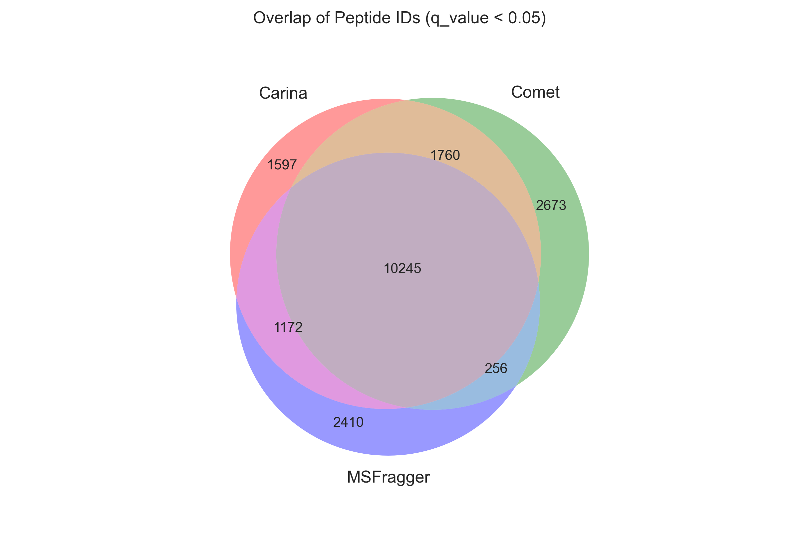
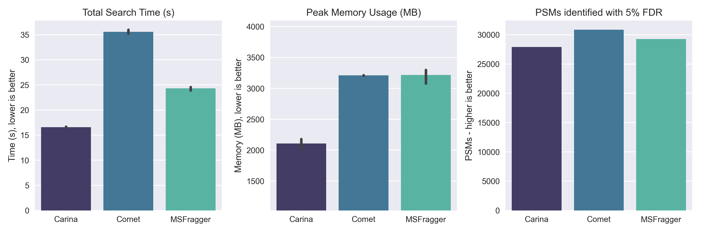

# Proteomics Database in a Weekend!

I wanted to see how far I could take a proteomics search engine in ~1000 lines of code, and spending only one weekend on it. 

I was inspired by the elegant data structure discussed in the [MSFragger paper](https://www.ncbi.nlm.nih.gov/pmc/articles/PMC5409104/), and decided to implement a version of it in Rust
 
### Features

- Search by fragment, filter by precursor: memory layout using sorted tables for blazing fast performance (lots of binary searching!)
- Internal support for static/variable mods
- X!Tandem hyperscore function
- Interal q-value/FDR calculation using a target-decoy competition approach
- No unsafe
- Percolar output

### Limitations

- Only uses MS2 files
- Only percolator PIN output
- Lots of hardcoded parameters (however, you can supply static mods/missed cleavages, etc)
- Only outputs 1 protein ID even if the peptide is shared by multiple proteins :)
- Probably has some calculation errors :)

## Performance

### **High res Human TMT search**

Paper: [Benchmarking the Orbitrap Tribrid Eclipse for Next Generation
Multiplexed Proteomics](https://pubs.acs.org/doi/10.1021/acs.analchem.9b05685?goto=supporting-info)

Data: [PXD016766](http://proteomecentral.proteomexchange.org/cgi/GetDataset?ID=PXD016766)

Search settings: 50ppm precursor, 10ppm fragment

- 12 MS2 files extracted using MSConvert (HRMS2 files)
- Latest Human proteome FASTA database
- Internal decoy generation
- Fragment bucket size: 8196
- N-term TMT modification
- Static mod, TMT on Lys 
- Static mod, IA on Cys

***Carina* has good PSM identity overlap**

**And excellent performance** (it could do a bit better at PSM ID though)

- Active scanning: ~36,500 scans/s
- Amortized scanning: ~5250 scans/s (most time used on fragment indexing, IO)

---

### **Low res Yeast search**

Raw data extracted using RawConverter to MS2 format
Test data from [PXD001928](http://proteomecentral.proteomexchange.org/cgi/GetDataset?ID=PXD001928) (Yeast_XP_Tricine_trypsin_147.ms2)

On my 6-year old 4-core desktop:

In silico digestion and generation of sorted fragment tables: ~12 s

Wide search with 300ppm fragment window and 5 Th precursor window:
- ~2300 scans/sec
- Total run time: 27.5s for a single raw file, < 2 Gb of peak memory usage
- Percolator/Mokapot results: 13,784 PSMs with q <= 0.05

Narrow search - 10ppm fragment window and 1 Th precursor window:
- ~19,000 scans/sec
- Total run time: 17.2s for a single raw file, < 2 Gb of peak memory usage
- Percolator/Mokapot results: 452 PSMs with q <= 0.05

