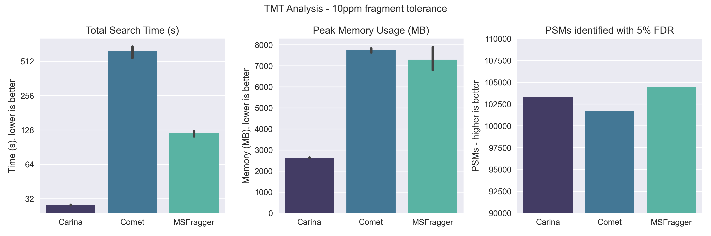
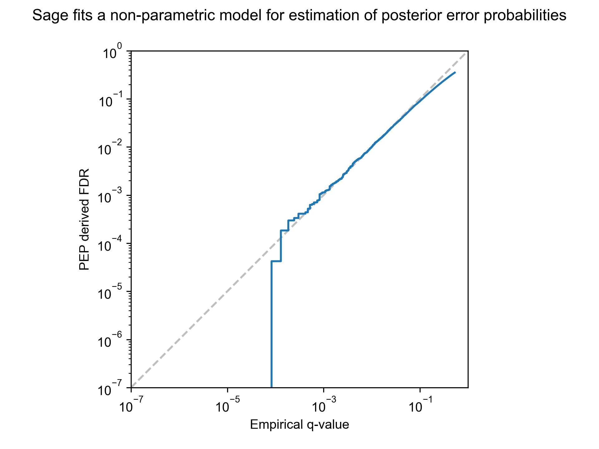

# Proteomics Search Engine with Magical Performance

[](https://github.com/lazear/sage/actions/workflows/rust.yml)

Check out the [blog post](https://lazear.github.io/sage/) for more information and full benchmarks!



I was inspired by the elegant data structure discussed in the [MSFragger paper](https://www.ncbi.nlm.nih.gov/pmc/articles/PMC5409104/), and decided to implement an (open source) version of it in Rust - with great results.

Sage has excellent performance characteristics (2-5x faster, 2-3x reduction in memory use compared to - the closed source - MSFragger), but does not sacrifice code quality or size to do so!
 
## Features & Anti-Features

- Incredible performance out of the box
- Effortlessly cross-platform (Linux/MacOS/Windows), effortlessly parallel (uses all of your CPU cores)
- Fragment indexing strategy allows for blazing fast narrow and open searches
- Capable of searching for chimeric/co-fragmenting spectra
- FDR calculation using target-decoy competition, with built-in linear discriminant anlysis
- PEP calculation using a non-parametric model (KDE)
- Percolator/Mokapot compatible output
- Small and simple codebase
- Configuration by JSON files
- Only uses mzML files
- Only Percolator PIN output
- Only outputs 1 protein ID even if the peptide is shared by multiple proteins


### Assign multiple peptides to complex spectra


### Sage includes built-in model for FDR refinement and PEP calculation

- Hand-rolled, 100% pure Rust implementations of Linear Discriminant Analysis and KDE-mixture models for refinement of false discovery rates
- Both models demonstrate 1:1 results with scikit-learn, but have increased performance
- No need for a second post-search pipeline step




# Usage 

Sage takes a single command line argument: a path to a JSON-encoded parameter file (see below). A new file (`results.json`) will be created that details input/output paths and all search parameters used for the search

Example usage: `sage tmt.json`

Sage search settings file:
```json
{
  "database": {
    "bucket_size": 8192,
    "fragment_min_mz": 75.0,
    "fragment_max_mz": 1500.0,
    "peptide_min_len": 5,
    "peptide_max_len": 50,
    "missed_cleavages": 1,
    "static_mods": {
      "^": 229.1629,
      "K": 229.1629,
      "C": 57.0215
    },
    "variable_mods": {
      "M": 15.9949
    }
    "decoy_prefix": "rev_",
    "fasta": "2022-07-23-decoys-reviewed-UP000005640.fas"
  },
  "precursor_tol": {
    "ppm": [-20, 20]
  },
  "fragment_tol": {
    "ppm": [-10.0, 10.0]
  },
  "isotope_errors": [
    -1,
    3
  ],
  "report_psms": 1,
  "chimera": false,
  "deisotope": true,
  "process_files_parallel": true,
  "mzml_paths": [
    "dq_00082_11cell_90min_hrMS2_A1.mzML",
    "dq_00083_11cell_90min_hrMS2_A3.mzML",
    "dq_00084_11cell_90min_hrMS2_A5.mzML",
    "dq_00085_11cell_90min_hrMS2_A7.mzML",
    "dq_00086_11cell_90min_hrMS2_A9.mzML",
    "dq_00087_11cell_90min_hrMS2_A11.mzML",
    "dq_00088_11cell_90min_hrMS2_B1.mzML",
    "dq_00089_11cell_90min_hrMS2_B3.mzML",
    "dq_00090_11cell_90min_hrMS2_B5.mzML",
    "dq_00091_11cell_90min_hrMS2_B7.mzML",
    "dq_00092_11cell_90min_hrMS2_B9.mzML",
    "dq_00093_11cell_90min_hrMS2_B11.mzML"
  ]
}
```

