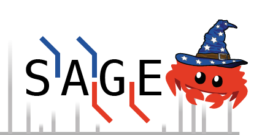

# Sage: proteomics searching so fast it seems like magic

 

For more information please read [the online documentation!](https://sage-docs.vercel.app/docs)

# Introduction
 
Sage is, at it's core, a proteomics database search engine - 
    a tool that transforms raw mass spectra from proteomics experiments into peptide identifications 
    via database searching & spectral matching. 

However, Sage includes a variety of advanced features that make it a one-stop shop: retention time prediction, quantification (both isobaric & LFQ), peptide-spectrum match rescoring, and FDR control. You can directly use results from Sage without needing to use other tools for these tasks.

Additionally, Sage was designed with cloud computing in mind - massively parallel processing and the ability to directly stream compressed mass spectrometry data to/from AWS S3 enables unprecedented search speeds with minimal cost. 

 Sage also runs just as well reading local files from your Mac/PC/Linux device!

## Why use Sage instead of other tools?

Sage is **simple to configure**, **powerful** and **flexible**. 
It also happens to be well-tested, **mind-boggingly fast**, open-source (MIT-licensed) and free.

## Citation

If you use Sage in a scientific publication, please cite the following paper:

[Sage: An Open-Source Tool for Fast Proteomics Searching and Quantification at Scale](https://doi.org/10.1021/acs.jproteome.3c00486)

## Features

- Incredible performance out of the box
- [Effortlessly cross-platform](https://sage-docs.vercel.app/docs/started#download-the-latest-binary-release) (Linux/MacOS/Windows), effortlessly parallel (uses all of your CPU cores)
- [Fragment indexing strategy](https://sage-docs.vercel.app/docs/how_it_works) allows for blazing fast narrow and open searches (> 500 Da precursor tolerance)
- [Isobaric quantification](https://sage-docs.vercel.app/docs/how_it_works#tmt-based) (MS2/MS3-TMT, or custom reporter ions)
- [Label-free quantification](https://sage-docs.vercel.app/docs/how_it_works#label-free): consider all charge states & isotopologues *a la* FlashLFQ
- Capable of searching for [chimeric/co-fragmenting spectra](https://sage-docs.vercel.app/docs/configuration/additional)
- Wide-window (dynamic precursor tolerance) search mode - [enables WWA/PRM/DIA searches](https://sage-docs.vercel.app/docs/configuration/tolerance#wide-window-mode)
- Retention time prediction models fit to each LC/MS run
- [PSM rescoring](https://sage-docs.vercel.app/docs/how_it_works#machine-learning-for-psm-rescoring) using built-in linear discriminant analysis (LDA)
- PEP calculation using a non-parametric model (KDE)
- FDR calculation using target-decoy competition and picked-peptide & picked-protein approaches
- Percolator/Mokapot [compatible output](https://sage-docs.vercel.app/docs/configuration#env)
- Configuration by [JSON file](https://sage-docs.vercel.app/docs/configuration#file)
- Built-in support for reading gzipped-mzML files
- Support for reading/writing directly from [AWS S3](https://sage-docs.vercel.app/docs/configuration/aws)

## Interoperability

Sage is well-integrated into the open-source proteomics ecosystem. The following projects support analyzing results from Sage (typically in addition to other tools), or redistribute Sage binaries for use in their pipelines. 

- [SearchGUI](http://compomics.github.io/projects/searchgui): a graphical user interface for running searches
- [PeptideShaker](http://compomics.github.io/projects/peptide-shaker): visualize peptide-spectrum matches
- [MS2Rescore](http://compomics.github.io/projects/ms2rescore): AI-assisted rescoring of results
- [Picked group FDR](github.com/kusterlab/picked_group_fdr): scalable protein group FDR for large-scale experiments
- [sagepy](https://github.com/theGreatHerrLebert/sagepy): Python bindings to the sage-core library
- [quantms](https://github.com/bigbio/quantms): nextflow pipeline for running searches with Sage
- [OpenMS](https://github.com/OpenMS/OpenMS): Sage is included as a "TOPP" tool in OpenMS
- [sager](https://github.com/UCLouvain-CBIO/sager): R package for analyzing results from Sage searches
- If your project supports Sage and it's not listed, please open a pull request! If you need help integrating or interfacing with Sage in some way, please reach out.

Check out the (now outdated) [blog post introducing the first version of Sage](https://lazear.github.io/sage/) for more information and full benchmarks!
