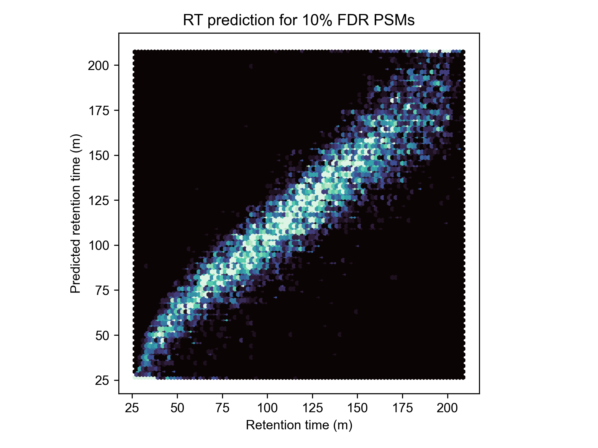

# Proteomics Search Engine with Magical Performance

[](https://github.com/lazear/sage/actions/workflows/rust.yml)

Check out the [blog post](https://lazear.github.io/sage/) for more information and full benchmarks!


I was inspired by the elegant data structure discussed in the [MSFragger paper](https://www.ncbi.nlm.nih.gov/pmc/articles/PMC5409104/), and decided to implement an (open source) version of it in Rust - with great results.

Sage has excellent performance characteristics (5x faster than - the closed source - MSFragger), but does not sacrifice code quality or size to do so!
 
## Features

- Incredible performance out of the box
- Effortlessly cross-platform (Linux/MacOS/Windows), effortlessly parallel (uses all of your CPU cores)
- Fragment indexing strategy allows for blazing fast narrow and open searches
- MS3-TMT quantification (experimental!)
- Capable of searching for chimeric/co-fragmenting spectra
- FDR calculation using target-decoy competition, with built-in linear discriminant anlysis
- PEP calculation using a non-parametric model (KDE)
- Percolator/Mokapot compatible output
- Small and simple codebase
- Configuration by JSON files


### Assign multiple peptides to complex spectra


### Sage includes built-in models for FDR refinement and posterior error probability calculation

- Hand-rolled, 100% pure Rust implementations of Linear Discriminant Analysis and KDE-mixture models for refinement of false discovery rates
- Both models demonstrate 1:1 results with scikit-learn, but have increased performance
- No need for a second post-search pipeline step


- Further boost PSM identification (by 1-3%) using prediction of retention times by a [linear regression model](https://doi.org/10.1021/ac070262k)



# Installation

1. Install the [Rust programming language compiler](https://rustup.rs/)
2. Download Sage source code via git: `git clone https://github.com/lazear/sage.git` or by [zip file](https://github.com/lazear/sage/archive/refs/heads/master.zip)
3. Compile: `cargo build --release`
4. Run: `./target/release/sage config.json`

Once you have Rust installed, you can copy and paste the following lines into your terminal to complete the above instructions, and run Sage on the example mzML provided in the repository (a single scan from PXD016766)

```sh
git clone https://github.com/lazear/sage.git
cd sage
cargo run --release tests/config.json 
```

# Usage 

Sage takes a single command line argument: a path to a JSON-encoded parameter file (see below). 

Example usage: `sage config.json`

Running Sage will produce several output files:
- Record of search parameters (`results.json`) will be created that details input/output paths and all search parameters used for the search
- MS2 search results will be stored as a Percolator-compatible (`<mzML path>.sage.pin`) file - this is just a tab-separated file, which can be opened in Excel/Pandas/etc
- MS3 search results will be stored as a CSV (`<mzML path>.quant.csv`) if "quant" option is used in the parameter file

Sage search settings files have the following parameters:

Two notes:
- The majority of parameters are optional - only "database.fasta", "precursor_tol", and "fragment_tol" are required. Sage will try and use reasonable defaults for any parameters not supplied
- Tolerances are specified on the *experimental* m/z values. To perform a -100 to +500 Da open search (mass window applied to *precursor*), you would use `"da": [-500, 100]`

```jsonc
{
  "database": {
    "bucket_size": 32768,           // How many fragments are in each internal mass bucket
    "fragment_min_mz": 200.0,       // Optional[float] {default=150.0}, Minimum mass of fragments to search
    "fragment_max_mz": 2000.0,      // Optional[float] {default=2000.0}, Maximum mass of fragments to search 
    "peptide_min_len": 5,           // Optional[int]{efault=5}, Minimum AA length of peptides to search
    "peptide_max_len": 50,          // Optional[int] {default=50}, Maximum AA length of peptides to search
    "peptide_min_mass": 500.0,      // Optional[float] {default=500.0}, Minimum monoisotopic mass of peptides to fragment
    "peptide_max_mass": 5000.0,     // Optional[float] {default=5000.0}, Maximum monoisotopic mass of peptides to fragment
    "min_ion_index": 2,     // Optional[int] {default=2}, Do not generate b1/b2/y1/y2 ions for preliminary searching. Does not affect full scoring of PSMs
    "missed_cleavages": 2,  // Optional[int], Number of missed cleavages for tryptic digest
    "static_mods": {        // Optional[Dict[char, float]] {default={}}, static modifications
      "^": 304.207,         // Apply static modification to N-terminus
      "K": 304.207,         // Apply static modification to lysine
      "C": 57.0215          // Apply static modification to cysteine
    },
    "variable_mods": {      // Optional[Dict[char, float]] {default={}}, variable modifications
      "M": 15.9949          // Variable mods are applied *before* static mods
    },
    "decoy_prefix": "rev_", // Optional[str] {default="rev_"}: Prefix appended to decoy proteins
    "fasta": "dual.fasta"   // str: mandatory path to fasta file
  },
  "quant": "Tmt16",         // Optional[str] {default=null}, one of "Tmt6", "Tmt10", "Tmt11", "Tmt16", or "Tmt18"
  "precursor_tol": {        // Tolerance can be either "ppm" or "da"
    "da": [
      -500,                 // This value is substracted from the experimental precursor to match theoretical peptides
      100                   // This value is added to the experimental precursor to match theoretical peptides
    ]
  },
  "fragment_tol": {         // Tolerance can be either "ppm" or "da"
    "ppm": [
     -10                    // This value is subtracted from the experimental fragment to match theoretical fragments 
     10                     // This value is added to the experimental fragment to match theoretical fragments 
    ]
  },
  "isotope_errors": [       // Optional[Tuple[int, int]] {default=[0,0]}: C13 isotopic envelope to consider for precursor
    -1,                     // Consider -1 C13 isotope
    3                       // Consider up to +3 C13 isotope (-1/0/1/2/3) 
  ],
  "deisotope": false,       // Optional[bool] {default=false}: perform deisotoping and charge state deconvolution
  "chimera": false,         // Optional[bool] {default=false}: search for chimeric/co-fragmenting PSMS
  "predict_rt": false,    // Optional[bool] {default=true}: use retention time prediction model as an feature for LDA
  "min_peaks": 15,          // Optional[int] {default=15}: only process MS2 spectra with at least N peaks
  "max_peaks": 150,         // Optional[int] {default=150}: take the top N most intense MS2 peaks to search,
  "max_fragment_charge": 1, // Optional[int] {default=null}: maximum fragment ion charge states to consider,
  "report_psms": 1,         // Optional[int] {default=1}: number of PSMs to report for each spectra. Recommend setting to 1, higher values might disrupt LDA
  "mzml_paths": ["path.mzML"]       // List[str]: representing relative (or full) paths to mzML files for search
}
```